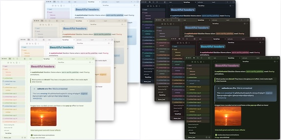

# TerraFlow

Nature-inspired Obsidian theme — seasonal palettes, Apple-style glass and depth, calm by default with funky opt-ins.

## Seasons

Ten palettes, each with full light & dark variants*: 🌱 Spring · ☀️ Summer · 🍂 Autumn · ❄️ Winter · 🧊 Iceberg · 📚 Academia* · 🌙 Twilight · 📄 Paper · 🍃 Calm Focus · 🏜️ Melange (adapted from [Baseline](https://github.com/aaaaalexis/obsidian-baseline))

Every season covers headings (H1–H6), callouts, code syntax, highlights — all WCAG-audited for contrast.

*Academia is dark-only.

## Highlights

- **Low Contrast Mode** — one calm, unified surface, works with any season
- **Color control** — heading intensity (muted/default/vivid), per-level H1–H6 pickers, season-tinted body text, P3 wide-gamut accents, custom accent, monochrome
- **Styles** — 7 heading styles, 4 link styles, 4 callout styles, glass highlights & blockquotes
- **Tasks & tables** — 18 alternate checkbox states, table density/striping/hover options
- **Deep Focus Mode** — sepia palette, typewriter dimming, hidden chrome
- **Interface** — card layout, depth shadows, whimsy animations, quiet mode, system font (SF Pro)

## Per-note `cssclasses`

| Class | Effect |
|---|---|
| `banner` | First `\|banner`-tagged image becomes a cover (add `banner-fade` for a fade) |
| `cards` | Dataview tables render as a card grid |
| `wide-page` / `full-page` | Widen the whole note |
| `wide-table` / `wide-image` | Widen only tables / images |

## Installation

**Settings → Appearance → Themes → Browse** → search *TerraFlow*.
Install [Style Settings](https://github.com/mgmeyers/obsidian-style-settings) to unlock all options — the theme works beautifully without it too.

## Credits

Melange palette via [Baseline](https://github.com/aaaaalexis/obsidian-baseline) / [melange-nvim](https://github.com/savq/melange-nvim) · Cards adapted from [@kepano](https://github.com/kepano)'s Cards snippet (MIT)

## License

MIT
