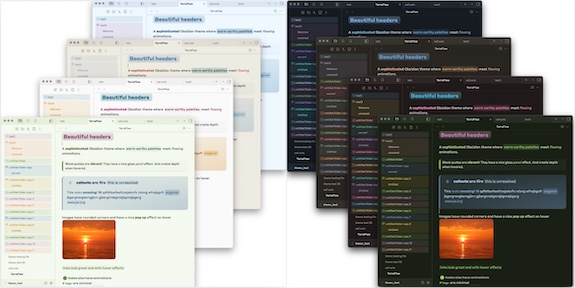
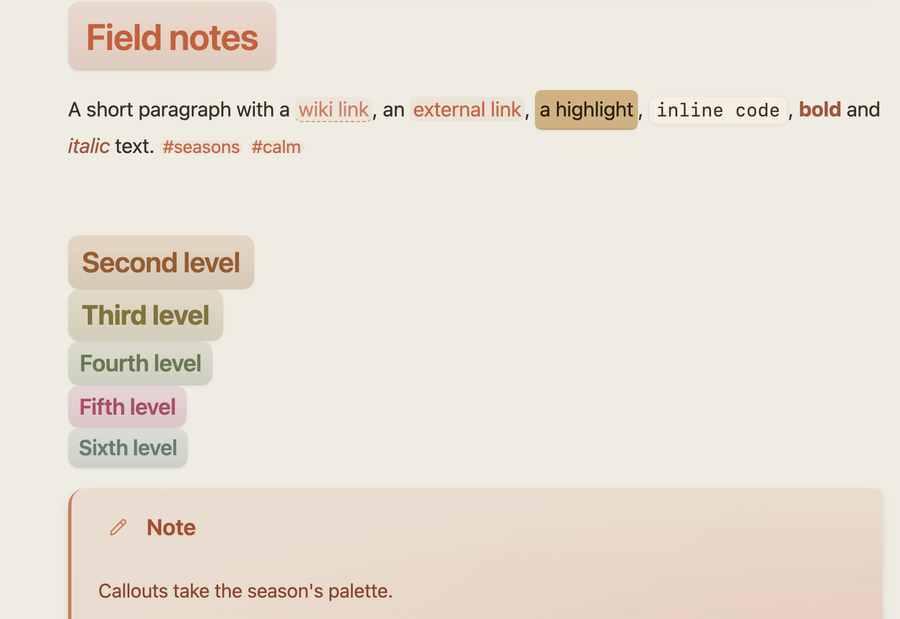
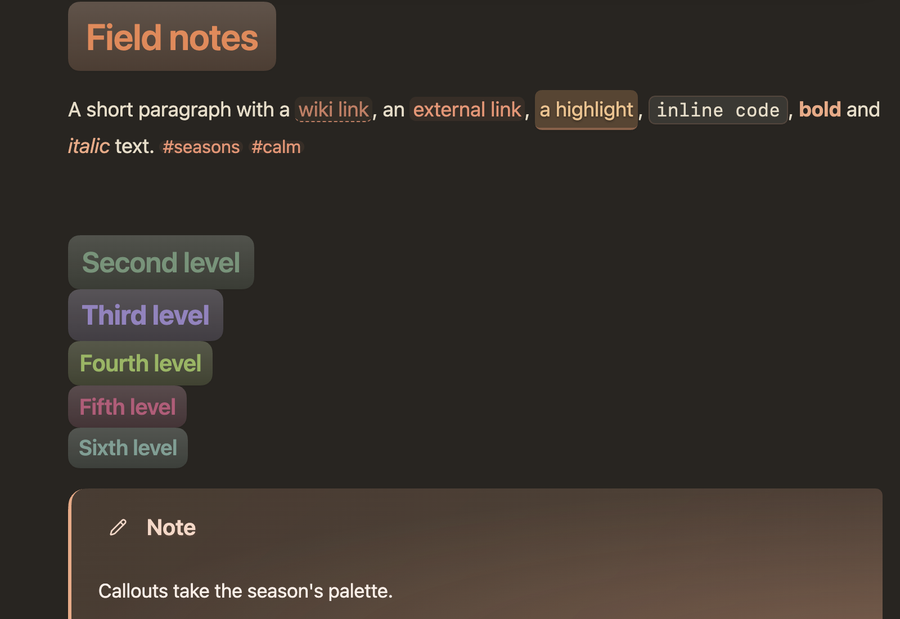
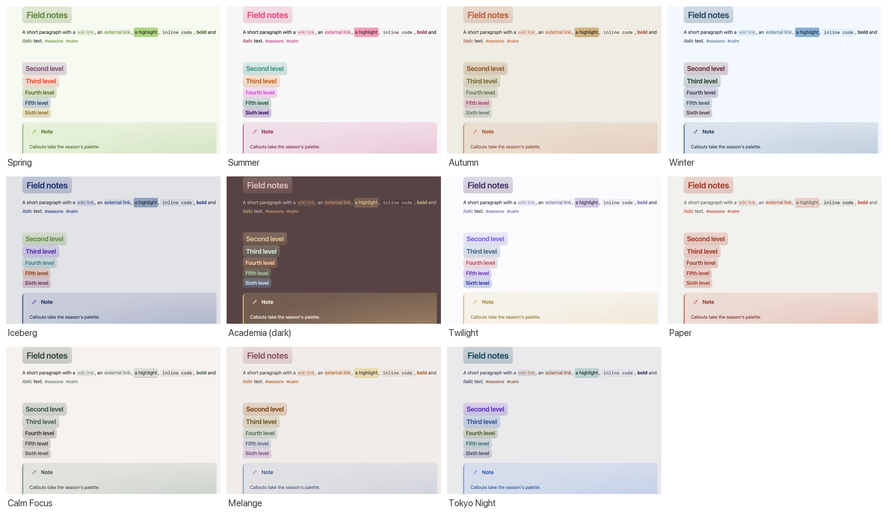
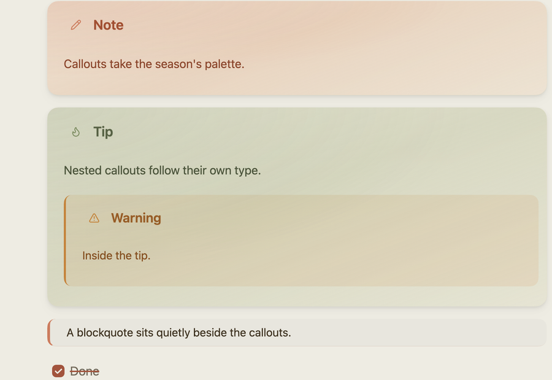
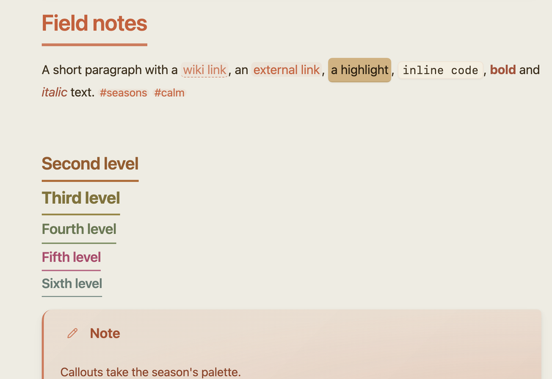
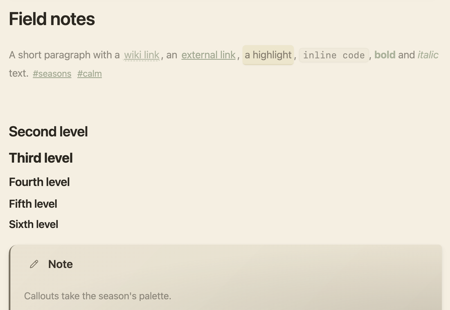
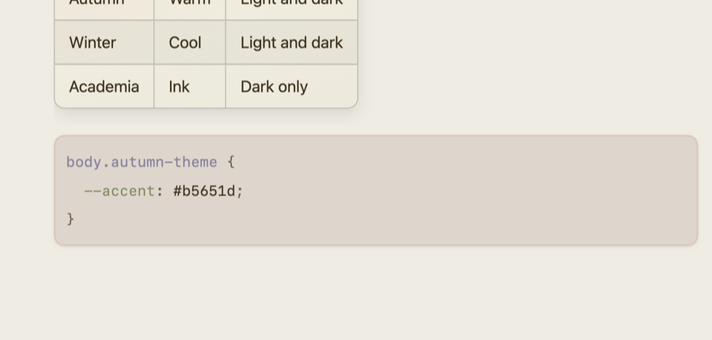

# TerraFlow



An Obsidian theme with seasonal palettes and Apple-style glass and depth. Calm by default, with expressive options you switch on yourself.

| Light | Dark |
|---|---|
|  |  |

## Seasons

Eleven palettes. Each covers headings (H1 to H6), callouts, code syntax and highlights.



| Season | Light | Dark |
|---|---|---|
| 🌱 Spring | yes | yes |
| ☀️ Summer | yes | yes |
| 🍂 Autumn | yes | yes |
| ❄️ Winter | yes | yes |
| 🧊 Iceberg | yes | yes |
| 📚 Academia | no | yes |
| 🌙 Twilight | yes | yes |
| 📄 Paper | yes | yes |
| 🍃 Calm Focus | yes | yes |
| 🏜️ Melange | yes | yes |
| 🌆 Tokyo Night | yes | yes |

## Calm by default

The screenshots above use the defaults. The louder features are options, and they stay off until you turn them on.

To go quieter still: Quiet mode, Softer look, Neutral chrome, Low contrast, Disable UI animations, Remove all shadows.

## Options

Every option lives in Style Settings, grouped as below.

- **Colors**: season, custom accent, monochrome, Low contrast, tinted body text, P3 vivid accents on wide-gamut displays.
- **Headings**: 8 styles, left or centered, muted, default or vivid color, custom H1 to H6 colors, per-level text case, balanced line wrapping, custom font.
- **Callouts and quotes**: 6 callout styles, 4 blockquote styles, nested callouts that follow the parent color.
- **Links, tags, highlights**: 4 link styles, minimal or glass tag chips, 3 highlight styles with adjustable strength.
- **Lists and tasks**: fancy bullets, over 25 alternate task states such as `[/]`, `[-]`, `[>]`, `[?]` and `[!]`.
- **Tables**: 3 densities, striping and hover toggles, glass tables with a sticky header in reading mode.
- **Glass**: tint strength, liquid command palette, liquid controls, glass status bar, glass properties panel.
- **Depth and motion**: layered shadows, tinted ambient shadows, elevation by surface tint, default or whimsy animation, fade-in on scroll.
- **Focus**: Deep focus mode (sepia palette, typewriter dimming, hidden sidebars and chrome), Hover lift.
- **Workspace**: card layout, 4 file explorer styles, pill tabs, floating nav buttons, auto-hide ribbon, reading progress bar.
- **Text and layout**: line width, line height, body weight, tabular numerals, optical centering, static or smooth caret.

### A few of them

| | |
|---|---|
|  |  |
| Liquid glass callouts | Underline headings |
|  |  |
| Deep focus mode with typewriter dimming | Glass tables |

## Per-note `cssclasses`

Add classes to a note's properties:

```yaml
---
cssclasses:
  - wide-page
---
```

| Class | Effect |
|---|---|
| `banner` | Turns an image into a cover. Mark the image with `![[image.png\|banner]]`. Add `banner-fade` for a fade. |
| `cards` | Renders Dataview tables as a card grid. Needs the Dataview plugin. |
| `wide-page`, `full-page` | Widens the whole note. |
| `wide-table`, `wide-image` | Widens only tables or images. |

## Installation

Open Settings, Appearance, Themes, Browse, and search for TerraFlow.

Install [Style Settings](https://github.com/mgmeyers/obsidian-style-settings) to choose a season and use the options above. Without it no season is active, so Obsidian's default colors show.

TerraFlow sets no fonts. Your Text font setting in Appearance applies. It needs Obsidian 1.0.0 or newer.

## Feedback

Report bugs or ask for features in [Issues](https://github.com/dubefab/obsidian-TerraFlow/issues). Release notes are in [Releases](https://github.com/dubefab/obsidian-TerraFlow/releases).

## Credits

- Melange palette adapted from [Baseline](https://github.com/aaaaalexis/obsidian-baseline) and [melange-nvim](https://github.com/savq/melange-nvim).
- Tokyo Night follows the Bear "Tokyo Night" and "Tokyo Night Light" themes.
- Cards adapted from [@kepano](https://github.com/kepano)'s Cards snippet (MIT).

## License

MIT
